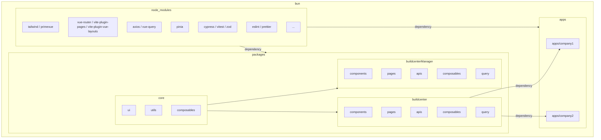

# 🔧 Bynd v3 프로젝트  
## 프론트엔드 개발 환경 운영 가이드
### (Frontend Development Operating Guide)

---

## 📚 목차 (Table of Contents)

1. [개발 철학](#0-개발-철학)
2. [Overview](#1-overview)
3. [기술 스택](#2-기술-스택-프레임워크-라이브러리-및-도구)
4. [아키텍처 개요](#3-아키텍처-개요)
5. [프로젝트 및 디렉토리 구조](#4-프로젝트-및-디렉토리-구조)
6. [파일 구성 및 작성 순서 컨벤션](#5-파일-구성-및-작성-순서-컨벤션)
7. [코드 스타일 및 네이밍 규칙](#6-코드-스타일-및-네이밍-규칙)
8. [TypeScript & Vue 규칙](#7-typescript--vue-규칙)
9. [코드 작성 원칙](#8-코드-작성-원칙)
10. [데이터 관리 규칙](#9-데이터-관리-규칙)
11. [테스트 전략](#10-테스트-전략)
12. [API 규칙](#11-api-규칙)
13. [라우터 설계](#12-라우터-설계)
14. [개발 인력 구성](#13-개발-인력-구성)
15. [요약](#✅-요약)

---

## 0. 개발 철학{#0-개발-철학}

### **단순하고 일관된 개발이 목표**
1. 😗 귀찮음을 최소화하자
   * 쉬운 코드 작성. 단순한 흐름.
   * 반복, 무의미한 코드 등 줄이기
2. 🤖❌ AI 사용이 어려운 환경 고려
4. 초기 편의보다 전체 개발 공수 최소화
5. 대충 코딩 금지 – **코드 부채 지양**

---

## 1. Overview

vue3 기반의 웹 프로젝트로, **buildcenter**와 **buildcenterManager** 두 개의 독립 서비스가 존재합니다.
- 구조: 본사 중앙 집중 + 회사별 커스터마이징이 가능한 운영 플랫폼\
  (Multi-tenant architecture with centralized control)
- 사용자(권한)
  - buildcenter[입주관리자, 빌딩관리자]
  - buildcenterManager[플랫폼 관리자]
- 목표: 공통 모듈과 회사별 확장 구조를 통해 빠른 커스터마이징과 유지보수 용이성 확보

---

## 2. 🧱 기술 스택 (프레임워크 라이브러리 및 도구)

* **Frameworks / Libraries / Tools**

  * Bun (모노레포 기반의 마이크로서비스 개발 및 실행 도구)
  * Vue 3 + TypeScript (script setup)
  * Vue Router (라우팅) + vite-plugin-pages (가상 페이지 라우팅) + vite-plugin-vue-layouts (레이아웃 관리)
  * vue-query (데이터 캐싱) + Pinia (상태관리)
  * primevue (UI 컴포넌트) + tailwindcss (CSS 프레임워크)
  * Vitest (Unit Test) + Cypress (E2E Test)
  * eslint (코드 검사) + prettier (코드 포맷팅)
  * zod (TypeScript 기반 런타임 스키마 및 유효성 검증 도구)

---

## 3. 📐 아키텍처 개요

본 프로젝트는 다음과 같은 아키텍처 원칙을 따릅니다:

- 🏛 **중앙 통제형 멀티테넌시 구조**  
  `packages/core`는 모든 서비스에서 공통으로 사용되며, 각 회사별 앱은 `apps/%companyName%`로 분리되어, 공통 코어를 기반으로 한 개별 확장이 가능합니다.

- 🧱 **모듈화 및 계층 분리 설계**  
  기능 단위로 `composables`, `apis`, `query`, `components` 등 역할별 디렉토리 구조를 유지하며, 공통/개별 기능을 분리합니다.

- 🔄 **상태 및 데이터 흐름 관리**  
  `vue-query`와 `axios`를 함께 사용하여, 비동기 데이터의 일관된 흐름과 캐싱을 유지하고, `pinia`를 통한 전역 상태공유를 합니다.
  * `pinia`와 `directive`는 전역 공유가 필요한 최소한의 경우에만 사용하며, 일반적인 상태 전달은 `props`, `emit`, `composable`을 통해 구성하여 컴포넌트 간 의존성을 낮춥니다.

- 🧪 **테스트 중심 개발 구조**  
  `Vitest`(unit test), `zod`(schema validation), `Cypress`(E2E)를 활용해 기능 단위로 검증을 수행하며, 각 페이지 또는 기능별 테스트 전략을 병행합니다.

---

## 4. 📂 프로젝트 및 디렉토리 구조



---

## 5. 📄 파일 구성 및 작성 순서 컨벤션

### 파일 내 구성 규칙

1. Imports - 외부 라이브러리 및 공통 모듈
2. Composables - 공통 훅/로직 호출
3. Props / Emits - 컴포넌트 API 정의
4. Reactive State - 상태 변수 정의
4-1. 데이터 fetch를 위한 composable 호출
5. Functions - 로직 함수 정의  
6. Watch / Lifecycle - 생명주기

#### 파일 내 구성 규칙 예시

```ts
// pages/User/UserDetail/BasicInfo.vue

// 1. Imports – 외부 라이브러리 및 공통 모듈
import { ref, computed, watch, onMounted } from 'vue';
import { useRoute } from 'vue-router';
import { UpdateUserParams } from '@buildcenter/apis/types/user';
import { useUserQuery } from '@buildcenter/query/useUserQuery';
import { useUserMutation } from '@buildcenter/query/useUserMutation';
import { useEditMode } from '@core/composables/useEditMode';
import { UIForm, UIFormSchema } from '@core/components/UIForm';
import logger from '@core/utils/logger';
import alert from '@core/utils/alert';

// 2. Composables – 공통 로직, 유틸 호출
const route = useRoute();
const localLogger = logger.withName('pages/User/UserDetail');
const userId = computed(() => Number(route.params.userId)); 
const { isEditMode, editModeButtons, handleEditStart, handleEditCancel, handleEditSave } = useEditMode();

// 3. Props / Emits – props 정의 및 emits 사용
const emit = defineEmits<{
  update: [payload: { name: string; email: string }];
}>();

// 4. Reactive State – 상태 변수 정의
const isLoading = ref(false);
const formData = reactive<UpdateUserParams>({
  get userId() { return userId.value },
  name: '',
  email: '',
  companyName: '',
  buildingName: '',
  floor: '',
  phone: '',
  useYn: '',
  memo: ''
});
const schema = computed<UIFormSchema<UpdateUserParams>>(() => {
  return {
    row1: {
      name: { type: 'Text', label: '이름', grow: 2, disabled: !isEditMode },
      email: { type: 'Email', label: '이메일', disabled: !isEditMode }
    },
    row2: {
      companyName: { type: 'Text', label: '회사명', disabled: true },
      buildingName: { type: 'Text', label: '빌딩명', disabled: true },
      floor: { type: 'Select', label: '부서', options: [], disabled: !isEditMode }
    },
    row3: {
      phone: { type: 'Phone', label: '전화번호', disabled: !isEditMode },
      useYn: { type: 'Toggle', label: '사용여부', disabled: !isEditMode },
      memo: { type: 'Textarea', label: '메모', disabled: !isEditMode } 
    }
  }
});

// 4-1. 상태를 받아야하는 composables
const { data: userData, isLoading, isError } = useUserQuery(userId);
const { mutateAsync: updateUser } = useUserMutation();

// 5. Functions – 로직 함수 정의
const editStart = handleEditStart(() => {
  //...
});
const cancel = handleEditCancel(() => {
  //...
});
const submit = handleEditSave(() => {
  update();
});

const update = async () => {
  await updateUser(formData.value);
  emit('update', { ...formData.value });
  alert({ message: '사용자 정보가 업데이트되었습니다.' });
};

// 6. Watch / Lifecycle – watch, onMounted 등 생명주기 처리
watch(userData, () => {
  // ...
}, { immediate: true });

onMounted(() => {
  // ...
});
```

```html
<template>
  <UICard :buttons="editModeButtons">
    <UIForm :schema="formSchema" :data="userData" v-model="formData" />
  </UICard>
</template>
```

---

## 6. 💡 코드 스타일 및 네이밍 규칙

- 기능별 폴더 분리: `composables/`, `query/`, `apis/`
- 컴포넌트는 PascalCase, 함수는 camelCase 사용
- 전체 네이밍은 최대한 단순하게, 그러나 축약어 없이 읽기 쉽게 작성
- `UIX` 접두사: 공통 UI 컴포넌트 (`UICard`, `UIForm`, `UIButton`, `UITable` 등)
- 함수 관련
  - `useXXX`: 컴포저블 함수 (ex. `useUser`)
  - `useXXXQuery`: 데이터 fetching 관련 query 함수 (ex. `useUserQuery`)
  - `useXXXMutation`: 데이터 수정 관련 mutation 함수 (ex. `useUserMutation`)
  - `handleXXX`: 고차 함수 (ex. `handleEditStart`, `handleEditCancel`, `handleEditSave`)
  - `onXXX`: 이벤트 핸들러 (ex. `onMounted`, `onUnmounted`, `onClick`, `onChange`)
- 상태 관리: 
  - 객체 타입은 `reactive()` 사용
  - 기본 타입은 `ref()` 사용
  - `ref({ ... })` 형태는 지양 (확장 어려움)
- `fetchXXX`: 데이터 fetching 관련 함수
- 테스트 파일 네이밍:
  - `*.spec.ts`: 단위 테스트
  - `*.cy.ts`: Cypress E2E 테스트
- 캐시에 prefix 설정 필수 및 `utils/cache.ts`: 
  - `[@Bynd_Cache]`, `[@Company1_Cache]`, `[@Company2_Cache]` 등
  - 캐시 키 중복 방지

### 예시

#### 1. 컴포넌트 네이밍

---

## 7. ✍️ TypeScript & Vue 규칙

1. script는 `setup lang=ts` 고정
2. style은 `tailwindcss` 고정
3. 타입 선언 **명시적이고 정확하게!**
4. 진단 경고(Diagnostic) 있는 상태로 공용 브랜치 커밋 금지 ❌

---

## 8. ⚙️ 코드 작성 원칙

1. 각 컴포넌트는 **단일 목적**
2. 각 함수는 **단일 역할**
3. 데이터 불변성 유지 (원본 오염 금지)
4. 변수 변경은 반드시 return을 통해 반환
    - **알 수 없는 변경** 금지
    - 특수 케이스 제외(reactive 전체변경 등). 이 경우에도 명시적으로 보여야할 것
5. `main.ts` 직접 작성 금지

### 예시
#### 1. 각 컴포넌트는 **단일 목적**
bad ❌
```html
<template>
  <UICard>
    <UIForm :schema="formSchema" :data="data" v-model="form" />
  </UICard/>
  <UICard>
    <UIForm :schema="formSchema2" :data="data2" v-model="form2" />
  </UICard/>
  <UICard>
    <UIForm :schema="formSchema3" :data="data3" v-model="form3" />
  </UICard/>
</template>
```

good ✅
```html
<template>
  <FormUserBasicInfo />
  <FormUserCompanyInfo />
  <FormUserBuildingInfo />
</template>
```
-*컴포넌트를 목적 단위로 분리*

#### 2. 각 함수는 **단일 역할**
bad ❌
```ts
const onSubmitClick = async () => {
  if(form.value.name === ''
    ...
  ) {
    alert({ message: '이름을 입력해주세요.' });
    return;
  }

  const res = await fetchData('...')
  if(res.code !== 1) return;
  const res2 = await fetchData('...')
  ...
  const data10 = res2.map(item => {
    ...
  })

  ...
  assignData(form, data20)
}
```

good ✅
```ts
const onSubmitClick = async () => {
  if(!validate()) { alert({ message: '이름을 입력해주세요.' }); return; }
  await updateUser();
  fetchUser();
}
const validate = () => {
  // 유효성 검사 로직만
}
const fetchUser = (userId: number) => {
  // fetch(get) 만 해야함
}
const updateUser = (userId: number, user: UpdateUserParams) => {
  // update 만 해야함
}
```
-*각 역할별로 함수 분리. vue-query를 사용하기 때문에 이것보다 더 단순하기는 함*

#### 3. 데이터 불변성 유지 (원본 오염 금지) 예시
bad ❌
```ts
const { userData } = useUserQuery(userId);

<input v-model="userData.name" />
```

good ✅
```ts
const { userData } = useUserQuery(userId);
const form = reactive<UpdateUserParams>({
  name: '',
  email: '',
  companyName: '',
  buildingName: '',
  floor: '',
});

watch(userData, () => {
  assignData(form, userData);
});

<input v-model="form.name" />
```
-*데이터는 각 목적에 맞도록. 불변해야하는 데이터는 불변해야함.\
그런데 대부분 UI 내부에서 처리가 될 것이므로, 서비스 개발자는 사용할 일 별로 없음*

#### 4. 변수 변경은 반드시 return을 통해 반환
bad ❌
```ts
updateUser(userData); // 여기 내부에서 userData가 변경되고 있음. 그리고 userData는 불변해야함
changeFloorName(userData) // 여기 내부에서 userData.floorName을 변경하고 있음. 그리고 userData는 불변해야함
```

good ✅
```ts
// update만 함. formData는 변경안함. 파라미터니까.
// 변경해야하는 경우 리턴으로
const formData = await updateUser(formData); 
// formData를 변경하여야 하고, return으로 변경해야함.
const formData = changeFloorName(userData);
// reactive의 경우
const data = changeFloorName(userData);
assignData(formData, data); // assign으로 명시적 변경
```

#### 5. `main.ts` 직접 정의 금지
bad ❌
```ts
const longClick = () => {
  ...
}
app.directive('longClick', longClick);
```

good ✅
```ts
import { longClick } from '@core/directives/longClick';
app.directive('longClick', longClick);
```

---

## 9. ⚠️ 데이터 관리 규칙

* `inject`, `provide`, `globalProperties`, `this.$xxx` ❌ 금지
* 데이터 전달은 반드시 명시적으로:

  * `props`
  * `emit`
  * `Pinia` (상태 공유 필요 시)

---

## 10. 🧪 테스트 전략

* **E2E**: Cypress로 로그인 등 실제 동작 테스트
* **Unit Test**: Vitest로 composable, util 테스트

---

## 11. 🌐 API 규칙

1. HTTP 메서드는 용도에 맞게 (`GET`, `POST`, `PATCH`, `DELETE`)
2. Content-Type 등 request, response payload 규칙 통일
3. REST URL 네이밍 규칙 가이드 필요

   * 예: `/building/{id}`

---

## 12. 🔗 라우터 설계
* `vue-router` + `vite-plugin-pages` + `vite-plugin-vue-layouts` 사용 → **가상 페이지 라우팅 및 코드 스플리팅 가능**
  * `vue-router` 단독 사용 시, 수동으로 라우팅 구성 해야함
  * `Nuxt`도 비슷한 방식으로 라우팅 구성 자동화 가능하나 아래 이유로 채택하지 않음.
    - 관리툴이므로 서버 렌더링(SSR), SEO, 정적 페이지 생성 필요 ❌. 
    - API도 외부에서 spring boot 프로젝트로 구현됨.

---

## 13. 개발 인력 구성

각 롤의 하위에 한가지 서비스에 한명의 메인개발자를 배정하여,\
큰 롤 하위의 개발자들끼리는 서로 일을 도와주는 형태가 좋을 듯(가능하다면...)

- **PM**: 1명 

  - 프로젝트 전체 관리
  - 개발 도구(bun, vite 등) 설정 및 Dev 환경 개선

- **Core Developer**: 2명

  - UI메인 1명, 유틸 메인 1명
  - packages/core 아래의 공통 모듈(UI, composables, utils) 개발
  - pinia/tailwind/eslint 등 전체 개발 컨벤션 설계
  - 플랫폼 전체 구조와 기반 코드 관리

- **서비스 기능 개발자**: 2명

  - 각 서비스별로 메인개발자 1명씩 필요(현재 buildcenter, buildcenterManager 2개 서비스로 가정)
  - buildcenter, buildcenterManager의 기능 구현
  - 각 회사별 앱(apps/company1 등)의 페이지 및 커스터마이징 구현
  - API 연동, Query 설계 및 비즈니스 로직 처리
  - unit & e2e 테스트 작성

- **테스트 담당 개발자**: 1명

  - E2E & 유닛 테스트 작성 전략 수립
  - 테스트 컨벤션 가이드 제공 (ex. 페이지당 테스트 1건 이상)
  - PR 시 테스트 커버리지 리뷰
  - Cypress / Vitest CI 자동화 연동

---

## ✅ 요약

- **목표**: 단순하고 일관된 Vue3 기반 멀티테넌시 프론트엔드 구조 설계
- **구조**: `packages/core`를 중심으로 `buildcenter`, `buildcenterManager`, `apps/company1` 등 개별 확장 가능 구조
- **스택**: Vue3, TypeScript, Bun, vite-plugin-pages, vue-query, Pinia, primevue, Tailwind, Cypress, Vitest, Zod 등
- **아키텍처 원칙**:
  - 중앙 집중형 멀티테넌시 구조
  - 역할 기반 모듈화 (`composables`, `query`, `apis`, `components`)
  - 컴포넌트 단일 목적, 함수 단일 역할 유지
- **작성 규칙**:
  - 명확한 컴포넌트/파일 구성 순서
  - `ref`, `reactive` 사용 기준 명확화
  - 원본 데이터 불변성 보장
  - main.ts 직접 수정 금지
- **테스트**: Cypress (E2E), Vitest (unit) 기반 테스트 전략 수립
- **API**: HTTP method, Content-Type, URL 네이밍 등 표준화 필요
- **인력 구성**: PM 1, Core 개발자 2, 서비스 개발자 2, 테스트 담당 1명

---

## 📞 감사합니다

---
